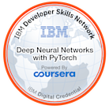

  

  
  

 

  
  
  
  
  

 

<h2>Languages and Tools:</h2>

  
  
  
  
  
  
  
  
  

   
	
  
  
  
  
  
  
  
  
  
  
  
  
  
  
  
  
  
  
  
  
  
  
  

  
More...
	
   

<h3>Publications</h3>

<h4>Journal Articles</h4>
<ul>
  <li>Sertel E., İlmak D., Aksoy S. & Ustaoğlu B. (2026). Machine learning-based LULC mapping with AlphaEarth foundation embeddings and Sentinel-2 multitemporal features: a comparative study focusing on hazelnut (Corylus avellana L.) orchards. <i>International Journal of Digital Earth</i>. <a href="https://doi.org/10.1080/17538947.2026.2732311" target="_blank">DOI: 10.1080/17538947.2026.2732311</a></li>
  <li>Ilmak D., Bakirman T. & Sertel E. (2025). Exploring YOLOv8 and YOLOv9 for Efficient Airplane Detection in VHR Remote Sensing Imagery. <i>Engineering Applications of Artificial Intelligence</i>. <a href="https://doi.org/10.1016/j.engappai.2025.111854" target="_blank">DOI: 10.1016/j.engappai.2025.111854</a></li>
</ul>

<h4>Conference Papers</h4>
<ul>
  <li>İban M., Bayrak O.C., Kartal S., Ilmak D. & Şeker D. (2025). PalmCity: An Emerging Benchmark Dataset for Semantic Segmentation of Panoramic Street View Images in Under-Represented Developing Countries. <i>ICCSA 2025 Workshops, pp. 165-175</i>. <a href="https://doi.org/10.1007/978-3-031-97663-6_14" target="_blank">DOI: 10.1007/978-3-031-97663-6_14</a></li>
  <li>İlmak D., İban M.C. & Şeker D.Z. (2024). A Geospatial Dataframe of Collapsed Buildings in Antakya City after the 2023 Kahramanmaraş Earthquakes Using YOLO and VHR Satellite Images. <i>IGARSS 2024, Athens (IEEE), pp. 3915-3919</i>. <a href="https://doi.org/10.1109/IGARSS53475.2024.10642920" target="_blank">DOI: 10.1109/IGARSS53475.2024.10642920</a></li>
  <li>Ilmak D., İban M.C. & Şeker D.Z. (2024). Deep Learning-Based Scene Classification of VHR Satellite Imagery for Post-Earthquake Damage Assessment. <i>ISPRS Archives XLVIII-4-W9-2024, pp. 249-256</i>. <a href="https://doi.org/10.5194/isprs-archives-XLVIII-4-W9-2024-249-2024" target="_blank">DOI: 10.5194/isprs-archives-XLVIII-4-W9-2024-249-2024</a></li>
  <li>Ilmak D., Uyar S. & Iban M.C. (2024). Classification of Sentinel-2 Images with AI Algorithms and Explainability Using SHAP. [3rd Place Oral Presentation Award]. <i>IX. UZAL-CBS Symposium 2024</i></li>
  <li>Adak O., Acı Ç.I. & İlmak D. (2024). Comparative Classification Performance Evaluation of ML and DL Techniques for BreakHis, Wisconsin, and DDSM Breast Cancer Datasets. <i>ICENSTED 2024</i></li>
</ul>

 

		

<!--
**doguilmak/doguilmak** is a ✨ _special_ ✨ repository because its `README.md` (this file) appears on your GitHub profile.

Here are some ideas to get you started:

### Hi there 👋

- 🔭 I’m currently working on ...
- 🌱 I’m currently learning ...
- 👯 I’m looking to collaborate on ...
- 🤔 I’m looking for help with ...
- 💬 Ask me about ...
- 📫 How to reach me: ...
- 😄 Pronouns: ...
- ⚡ Fun fact: ...
-->
